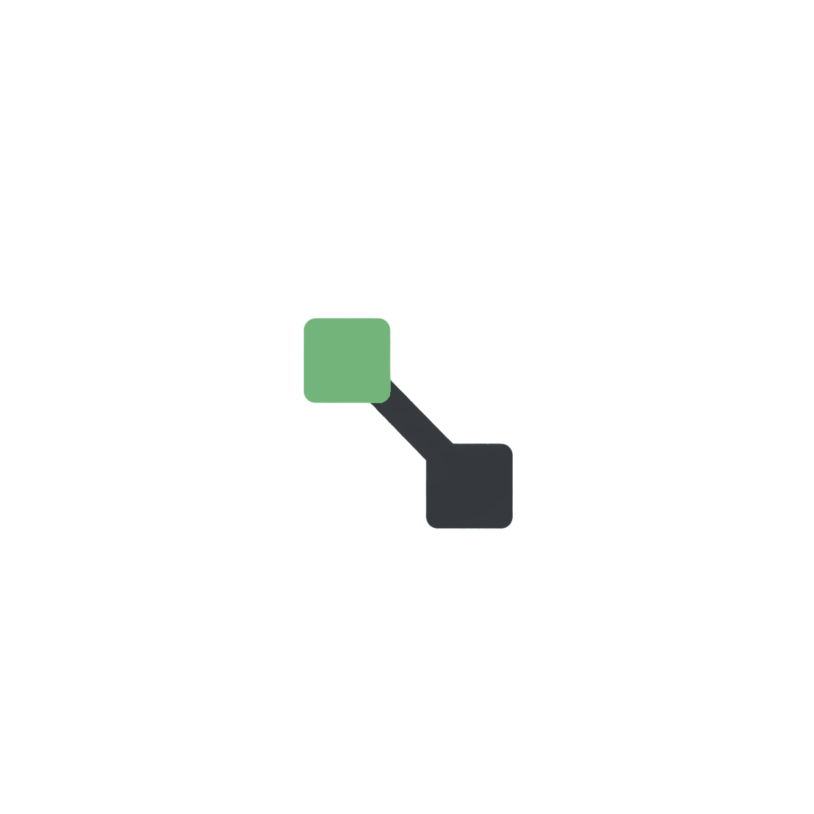
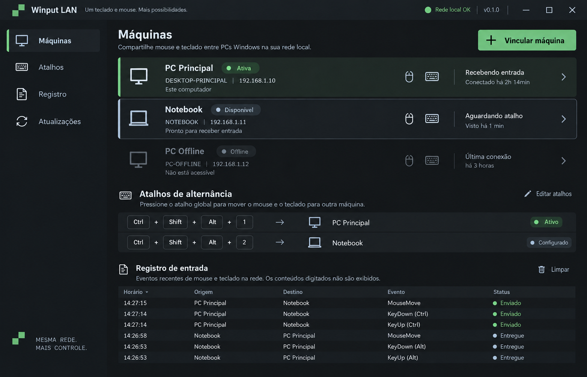

# Winput LAN





Winput LAN is a local-first Windows utility that lets one paired PC use its
keyboard and mouse on another PC on the same LAN. There is one active target;
switching back to the local machine is always available.

The MVP is a framework-dependent WPF application targeting .NET Framework 4.8.
It uses a persistent TCP connection with TLS 1.2, mutual device certificates,
versioned binary frames, heartbeat, bounded input queues, and `SendInput` on
the receiving machine. The app does not scan, discover, broadcast, upload
telemetry, or use a cloud control plane.

## Quick start

1. Build the Release solution with `powershell -ExecutionPolicy Bypass -File scripts/build.ps1`.
2. Run `src/WinputLan/bin/Release/net48/WinputLan.exe` on both PCs.
3. Permit the explicit Private-profile rule created by the Inno Setup installer
   (portable mode can run `scripts/install-firewall.ps1`, which may request UAC).
4. On one PC, enter the peer's LAN address and choose **Connect & pair**.
5. Verify that the six-digit code is identical on both screens and confirm on
   both PCs. The peer certificate is then pinned and the pin record is protected
   with Windows DPAPI.
6. Use `Ctrl+Shift+Alt+1` for local input and `Ctrl+Shift+Alt+2` for the active
   paired peer. These shortcuts are configurable in the per-user config file.

The default listener is TCP `45900` on the Private Windows firewall profile.
There is no discovery: enter an address explicitly. The config and protected
identity are stored below `%LOCALAPPDATA%\WinputLan`.

## Build and verify

```powershell
pwsh -File scripts/build.ps1
pwsh -File scripts/finalize.ps1
pwsh -File scripts/validate-release.ps1
```

The tests are dependency-light console tests. They cover framing, SAS/HKDF,
DPAPI abstraction, config corruption, bounded queue order/coalescing, hotkey
validation, privacy logging, manifest invariants, and reconnect backoff. The
net48 loopback harness creates two independent certificates, performs bilateral
pairing, stores pin material, and transports a synthetic input event without
moving real user input.

## Security and limits

The SAS is derived from the TLS transcript inputs and is displayed locally; it
is never sent as a network field. Transport keys are provided by TLS; the only
additional KDF is platform-primitive HMAC-SHA-256 HKDF for transcript-bound
material. Private keys and pin material are protected with DPAPI CurrentUser.
After pairing, the remote certificate fingerprint is required on reconnect.

The process runs as the interactive user (`asInvoker`). `WH_KEYBOARD_LL`,
`WH_MOUSE_LL`, and `SendInput` can be affected by UIPI/UAC boundaries. Secure
desktop actions such as `Ctrl+Alt+Del` are outside the contract. A hook can be
unavailable in hardened environments; Winput LAN stays in local-safe mode and
releases tracked keys/buttons on disconnect.

Authenticode is required by the updater manifest and installer validation. A
release certificate is not included in this repository, so unsigned builds are
for development only and are not accepted by the default update path.

See [ARCHITECTURE](docs/ARCHITECTURE.md), [SECURITY](docs/SECURITY.md),
[PROTOCOL](docs/PROTOCOL.md), [TESTING](docs/TESTING.md), and
[RELEASING](docs/RELEASING.md).
